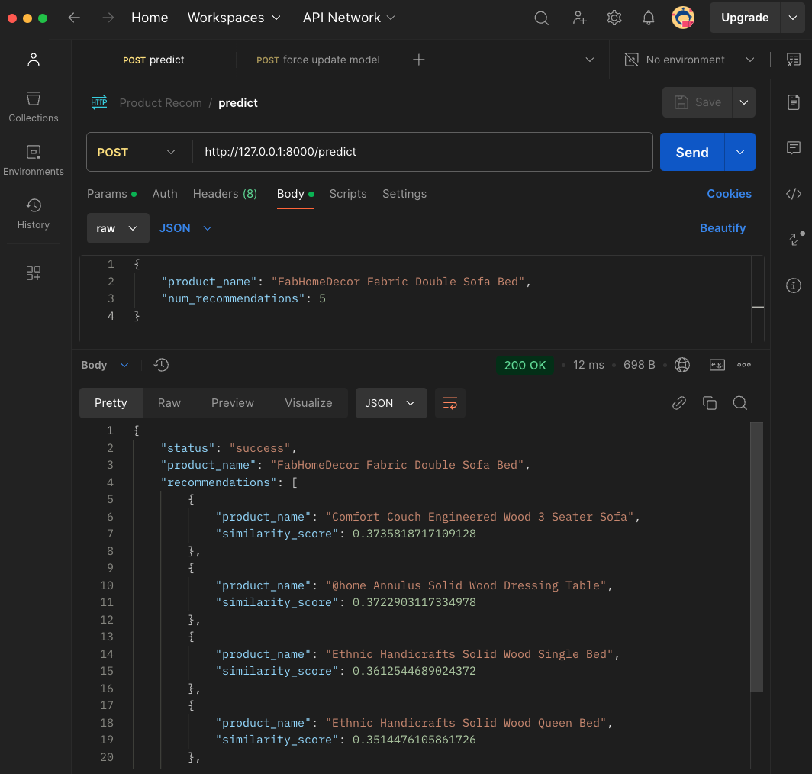

# Content-Based Product Recommendation System


<br>
Jupyter Notebook <a href="data/notebook/notebook.ipynb" target="_blank">View Here</a>

## Overview

This project implements a content-based recommendation system for e-commerce products using natural language processing and machine learning techniques.

## Key Features

##### 1. Data Preprocessing

- Handles product data from Flipkart dataset
- Cleans and processes text data including:
- Product names
- Product descriptions
- Brand information
- Product category trees

##### 2. Text Processing Pipeline

- Text Cleaning Steps:
- Lowercase conversion
- Stopword removal
- Punctuation removal
- Word tokenization
- Lemmatization

##### 3. Feature Engineering

- Uses TF-IDF Vectorization
- Processes word unigrams and bigrams
- Creates numerical representations of text data
- Handles custom stopwords
- Minimum document frequency filtering

##### 4. Similarity Computation

- Implements cosine similarity metrics
- Creates a product-to-product similarity matrix
- Enables quick lookup of similar products

##### 5. Recommendation Engine

- Provides top-N product recommendations
- Returns similar products based on:
- Product content
- Brand information
- Category hierarchy
- Product descriptions

##### 6. Performance Features

- Handles duplicate product removal
- Efficient similarity computation
- Scalable to large product catalogs
- Technical Implementation
- Built using Python

## Key libraries:

- pandas for data manipulation
- NLTK for text processing
- scikit-learn for TF-IDF and similarity computations
- NumPy for numerical operations
- Use Cases
- Product recommendations in e-commerce
- Similar product discovery
- Category-based product suggestions
- Content-based product matching

This system provides a robust foundation for implementing content-based product recommendations in an e-commerce setting, with emphasis on text processing and similarity-based matching.

## Project Structure

```bash
├── README.md
├── app
│   ├── __init__.py
│   ├── __pycache__
│   │   ├── __init__.cpython-310.pyc
│   │   ├── config.cpython-310.pyc
│   │   ├── configs.cpython-313.pyc
│   │   ├── main.cpython-310.pyc
│   │   ├── main.cpython-313.pyc
│   │   ├── models.cpython-310.pyc
│   │   └── utils.cpython-310.pyc
│   ├── config.py
│   ├── controllers
│   │   ├── __pycache__
│   │   └── recommendation_controller.py
│   ├── data
│   │   ├── model
│   │   └── nltk_data
│   ├── main.py
│   ├── models
│   │   ├── __pycache__
│   │   └── schemas.py
│   ├── routes
│   │   ├── __pycache__
│   │   └── recommendation_route.py
│   ├── services
│   │   ├── __pycache__
│   │   └── recommendation_service.py
│   └── utils
│       ├── __pycache__
│       ├── data_preprocessor.py
│       ├── exception_handlers.py
│       ├── exceptions.py
│       ├── nltk_downloader.py
│       └── text_processor.py
├── data
│   ├── model
│   │   └── recommender_model.joblib
│   ├── notebook
│   │   └── notebook.ipynb
│   ├── processed
│   └── raw
│       └── flipkart_sample.csv
└── requirements.txt
```

## Steps

Make sure python 3.10 is installed

```bash
python3 --version
```

Create a virtual environment

```bash
python3 -m venv my_env
```

Activate created environment (Linux / MacOs)

```bash
source ./my_env/bin/activate
```

Activate created environment (Window)

```bash
my_env\Scripts\activate
```

Install packages from <code>requirements.txt</code>

```bash
pip3 install -r requirements.txt
```

Run the flask app <code>/app/main.py</code>

```bash
uvicorn --reload app.main:app
```

## API

Predict route


Force update model

